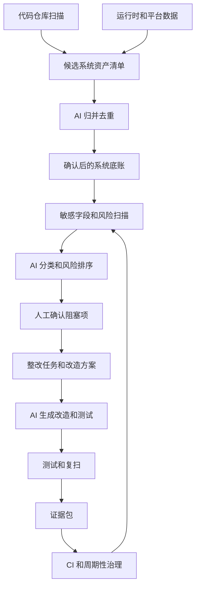
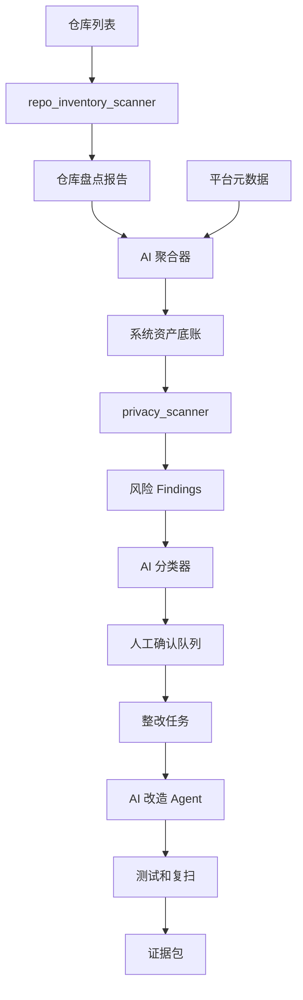
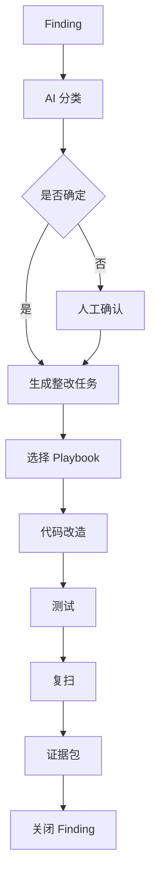

# 用户敏感信息脱敏合规改造 AI-SDLC 整体设计方案

## 1. 背景

本项目面向部门级技术系统的用户敏感信息脱敏合规改造，目标不是单点修复某个字段或某个服务，而是建立一套可复用、可审计、可持续演进的 AI-SDLC 工作体系。

部门内的系统通常存在以下特点：

- 系统数量多，形态复杂，包括 API 服务、后台系统、定时任务、数据同步、消息消费者、导出报表、风控链路、短信邮件通道等。
- 敏感字段分布广，手机号、邮箱、银行卡、身份标识、凭证密钥等可能出现在代码、数据库、消息、日志、链路追踪、报表、缓存和下游调用中。
- 历史系统命名不统一，同一个业务含义可能有多个字段名，例如 `phone`、`mobile`、`contactNo`、`receiverPhone`、`payerMobile`。
- 合规改造需要证据链，不能只依赖口头确认或人工经验。
- 如果完全依靠人工盘点、人工评审和人工改造，成本高、周期长、遗漏风险大。

因此，本项目采用 AI-First 的方式，将 AI 作为发现、归并、分类、生成整改方案、生成代码改造、生成测试和整理证据的主要执行者；人工主要负责规则制定、关键确认、风险审批和例外决策。

## 2. 目标

本项目的核心目标是建立一套部门级敏感信息脱敏合规改造流水线，使其具备以下能力：

- 自动发现部门系统资产。
- 自动识别系统中的用户敏感字段。
- 自动推断敏感数据入口、存储、出口和候选流转链路。
- 自动识别当前保护状态，例如 Token 化、KMS 加密、脱敏、明文或未知。
- 自动生成风险排序和人工确认清单。
- 自动生成整改任务、改造建议、测试建议和证据包。
- 在 CI 和周期性扫描中持续防止敏感信息重新暴露。
- 将过程中沉淀出的扫描规则、脱敏策略、改造 playbook、证据模板复用到其他部门或其他系统。

## 3. 非目标

第一阶段不追求一次性解决所有问题，明确以下非目标：

- 不要求第一版完成完整编译级静态数据流分析。
- 不要求第一阶段直接覆盖所有历史系统的全部字段链路。
- 不要求 AI 在不确定的情况下自动改造代码。
- 不把代码仓库扫描结果直接视为最终资产底账。
- 不把工具输出作为合规最终结论，最终结论需要经过确认和证据闭环。

第一阶段更关注覆盖面、证据链、可迭代机制和高风险出口优先治理。

## 4. 总体原则

### 4.1 AI 优先，人工兜底

AI 负责高覆盖、重复性、证据整理和初步判断工作。人工只处理 AI 无法确定或风险较高的事项。

人工重点参与：

- 敏感信息分类和默认策略确认。
- 系统归属确认。
- 明文使用场景确认。
- 例外审批。
- 高风险改造上线确认。

AI 重点承担：

- 代码仓库扫描。
- 字段语义识别。
- 数据流候选链路推断。
- 系统和模块归并。
- 风险排序。
- 整改任务生成。
- 改造 diff 生成。
- 测试生成。
- 证据包生成。

### 4.2 证据优先

任何 AI 判断都必须带证据，不允许只输出结论。

证据可以来自：

- 代码路径和行号。
- API 定义。
- DTO、Entity、Model、Schema。
- SQL、migration、ORM 映射。
- MQ topic 和 payload schema。
- 日志语句。
- 导出逻辑。
- 配置文件。
- CI、部署文件。
- 运行时平台、网关、监控、DB、MQ、日志平台的只读数据。

### 4.3 不确定即阻塞

用户已确认：当 AI 无法确定某个字段是否敏感，或者无法确定处理策略时，默认进入人工确认，不自动改造。

这条规则适用于：

- 字段是否敏感不确定。
- 保护状态不确定。
- 是否允许明文不确定。
- 是否属于合法业务场景不确定。
- 是否存在下游依赖不确定。

### 4.4 先建立基线，再用扫描结果迭代

敏感信息分类和策略不是完全人工制定，也不是完全扫描得出，而是两者结合。

第一步由人工制定基线：

- 手机号。
- 邮箱。
- 银行卡。
- 身份标识。
- 凭证密钥。
- 后续识别出的业务特有敏感字段。

第二步由扫描补充真实现状：

- 字段别名。
- 业务场景。
- 数据流路径。
- 明文出口。
- 历史兼容逻辑。
- 下游依赖。

第三步再反哺分类、策略、扫描规则和改造 playbook。

### 4.5 高风险出口优先

第一阶段优先治理以下高风险出口：

- 日志。
- 链路追踪。
- MQ。
- 导出文件。
- 后台页面。
- 下游系统调用。
- 短信通道。
- 邮件通道。
- API response。

原因是这些位置一旦暴露明文，扩散范围通常更大，证据回收更困难，合规风险更高。

## 5. 整体架构

本项目采用“发现、分类、确认、改造、验证、证据、治理”的闭环架构。



该闭环中，工具负责自动化执行，AI 负责语义理解和任务生成，人工负责关键决策。

## 6. 项目资产结构

当前项目已经沉淀以下资产：

- `docs/ai-sdlc/sensitive-data-taxonomy.yaml`
  敏感信息分类基线。

- `docs/ai-sdlc/masking-policy-catalog.yaml`
  脱敏、Token 化、KMS、禁止记录、明文访问等策略目录。

- `docs/ai-sdlc/pii-masking-compliance-plan.md`
  可执行合规改造计划。

- `docs/ai-sdlc/service-onboarding-checklist.md`
  系统接入检查清单。

- `docs/ai-sdlc/pilot-rollout.md`
  试点和扩展 rollout 方案。

- `tools/privacy-inventory/repo_inventory_scanner.py`
  代码仓库盘点脚本，生成候选系统资产、入口、存储、出口、敏感字段、候选数据流和人工确认项。

- `tools/privacy-inventory/inventory.schema.json`
  正式系统资产底账 schema。

- `tools/privacy-inventory/inventory.example.json`
  系统资产底账示例。

- `tools/privacy-scanner/privacy_scanner.py`
  敏感字段和风险位置扫描器。

- `tools/privacy-scanner/rules.json`
  扫描规则目录。

- `tools/privacy-remediation/playbooks.md`
  API、日志、后台、导出、数据管道、测试资产、自由文本等改造 playbook。

- `tools/privacy-remediation/masking.py`
  脱敏辅助函数原型。

- `tools/privacy-evidence/evidence.schema.json`
  证据包 schema。

- `tools/privacy-evidence/generate_evidence.py`
  证据包生成器。

- `.github/workflows/privacy-compliance.yml`
  CI 中的隐私合规扫描和证据产出流程。

## 7. AI-SDLC 阶段设计

### 7.1 阶段一：敏感信息基线定义

该阶段对应 Todo 1。

第一版敏感信息范围聚焦用户敏感信息，包括但不限于：

- 手机号。
- 邮箱。
- 银行卡。
- 身份标识。
- 凭证密钥。
- 后续通过扫描和试点发现的业务敏感字段。

用户已确认的策略基线：

- 手机号和银行卡优先使用专门 SDK 做 Token 化。
- 手机号和银行卡同时需要 KMS 加密作为兜底保护。
- 邮箱使用 KMS 加密。
- AI 不确定时必须人工确认，不自动改造。
- 明文可以存在，但必须是明确业务场景。
- 明文访问采用场景化策略引擎，根据用途、调用方、字段类型、用户动作、运行时上下文动态判断。
- 系统拿到明文后的处理规则按场景分别定义。

典型允许明文场景包括：

- 用户查看自己的信息。
- 风控使用明文进行实时判断。
- 短信发送需要手机号。
- 邮件发送需要邮箱。
- 其他经确认的业务场景。

该阶段产出：

- 分类基线。
- 默认策略基线。
- 明文使用原则。
- AI 不确定项处理原则。

### 7.2 阶段二：系统与数据流盘点

该阶段对应 Todo 2。

系统盘点不是单纯人工填表，也不是只依赖代码仓库。推荐采用多源合并：

- 代码仓库。
- 服务目录或 CMDB。
- 发布平台。
- K8s 或容器平台。
- 网关。
- 注册中心。
- 定时任务平台。
- DB 元数据。
- MQ 元数据。
- 日志和监控平台。

第一版可以从代码仓库优先开始，但仓库扫描结果只能作为候选底账，不能直接作为最终底账。最终底账至少需要被运行时平台、系统目录或负责人确认过。

代码仓库扫描优先级：

1. 仓库画像。
2. 服务和模块识别。
3. API、DB、MQ、日志、导出扫描。
4. 手机号、邮箱、银行卡字段识别。
5. 轻量数据流推断。
6. AI 归并和人工确认列表。

该阶段产出：

- 候选系统资产清单。
- 候选服务模块清单。
- 数据入口清单。
- 数据存储清单。
- 数据出口清单。
- 敏感字段字典。
- 候选数据流。
- 阻塞人工确认项。
- 风险摘要。

### 7.3 阶段三：敏感字段和风险扫描

该阶段对应 Todo 3。

扫描器分为两类：

- 仓库盘点扫描器：发现资产和候选数据流。
- 隐私风险扫描器：发现具体敏感字段、不安全上下文和整改位置。

扫描策略不能只依赖关键词，需要组合：

- 字段名规则。
- 多语言别名。
- 代码上下文。
- 文件路径上下文。
- DTO、Entity、Schema。
- SQL 和 ORM。
- 日志语句。
- API response。
- MQ producer 和 consumer。
- AI 语义判断。

扫描结果必须保留原始证据，不允许 AI 覆盖原始发现。AI 分类应该作为 enrichment 附加到 finding 上。

扫描输出需要包含：

- finding ID。
- 规则 ID。
- 敏感类别。
- 推荐策略。
- 严重级别。
- 置信度。
- 曝光面。
- 文件路径。
- 行号。
- 匹配文本。
- 代码片段。
- AI 分类状态。

### 7.4 阶段四：AI 分类、归并和风险排序

AI 在该阶段处理规则扫描难以完成的语义任务。

AI 主要负责：

- 合并同一字段的不同命名。
- 合并同一系统的多个仓库或模块。
- 判断字段是否真实敏感。
- 判断字段处于入口、存储还是出口。
- 判断是否已有 Token 化、KMS 加密、脱敏或禁止记录。
- 判断是否属于允许明文场景。
- 判断整改优先级。
- 生成待人工确认问题。

AI 输出必须满足：

- 每个结论都引用证据。
- 每个不确定点都进入 `unknowns` 或人工确认队列。
- 不确定项不能自动进入代码改造。
- 高风险出口优先排序。

风险排序建议考虑：

- 字段类型。
- 是否明文。
- 是否在日志、MQ、导出、后台、下游等出口。
- 是否外部可见。
- 是否生产路径。
- 是否有审计。
- 是否有访问控制。
- 影响用户规模。
- 修复复杂度。

### 7.5 阶段五：整改任务生成

AI 根据扫描结果和确认结果生成整改任务。

每个整改任务至少包含：

- 所属系统。
- 所属仓库。
- 敏感字段。
- 字段类别。
- 当前状态。
- 目标策略。
- 风险说明。
- 证据路径。
- 推荐 playbook。
- 涉及文件。
- 验收标准。
- 是否需要人工审批。
- 是否需要例外。

整改任务不应该只是“修复某个字段”，而应该围绕业务边界描述。例如：

```text
将用户资料 API response 中的 mobile 明文字段改为 mobileToken 或 maskedMobile，并保证日志、trace、导出中不再出现 mobile 明文。
```

### 7.6 阶段六：AI 生成改造

AI 可以根据 playbook 生成代码改造，但必须遵守以下规则：

- 优先在边界层改造，例如 serializer、mapper、DTO、日志 wrapper、export mapper。
- 不优先在业务核心逻辑里散落添加脱敏逻辑。
- 不确定字段不改。
- 不确定业务语义不改。
- 改造必须附带测试。
- 改造必须能生成证据。

已沉淀的 playbook 包括：

- API response masking。
- Log and trace sanitization。
- Admin、support、BI、export masking。
- Data pipeline masking。
- Test fixture and snapshot sanitization。
- Free-text redaction。

### 7.7 阶段七：验证和复扫

每个整改任务完成后，需要自动验证。

验证方式包括：

- 单元测试。
- API contract 测试。
- 日志扫描测试。
- 导出文件 golden test。
- 后台页面 snapshot。
- MQ payload schema 检查。
- scanner 复扫。
- evidence bundle 生成。

整改任务不能只看代码 diff 是否存在，而要看敏感值是否真的不再出现在目标出口。

### 7.8 阶段八：证据包生成

证据包是合规改造的关键产出。

每个证据包应连接：

- 原始 finding。
- AI 分类结论。
- 人工确认结果。
- 整改 diff。
- 测试结果。
- 复扫结果。
- 审批记录。
- 例外记录。

证据包用于：

- PR 审查。
- 合规审计。
- 试点验收。
- 周期性复查。
- 例外到期复审。

### 7.9 阶段九：CI 和持续治理

CI 中应执行：

- 代码仓库盘点扫描。
- 敏感字段风险扫描。
- 脱敏 helper 测试。
- 证据包生成。
- 证据产物上传。

当前 CI 已通过 `.github/workflows/privacy-compliance.yml` 产出：

- `docs/ai-sdlc/evidence/repo-inventory-scan.json`
- `docs/ai-sdlc/evidence/findings.json`
- `docs/ai-sdlc/evidence/evidence-bundle.json`

推荐治理节奏：

- 初期 advisory mode，只提示不阻塞。
- 规则调优后，对 critical finding 开始阻塞。
- 稳定后，对高置信 high finding 也逐步阻塞。
- 周期性全量扫描所有部门仓库。
- 周期性检查例外到期。
- 将误报和漏报反馈到规则库。

## 8. 数据流设计

整体数据流如下：



### 8.1 仓库盘点报告

仓库盘点报告由 `repo_inventory_scanner.py` 生成，包含：

- `repo_profile`
- `candidate_services`
- `entrypoints`
- `storage`
- `exits`
- `sensitive_fields`
- `data_flows`
- `unknowns`
- `risk_summary`

该报告的定位是“候选事实”，不是最终合规结论。

### 8.2 系统资产底账

确认后的系统资产底账使用 `inventory.schema.json` 表达。

每个系统至少需要包含：

- 系统 ID。
- 系统名称。
- 负责人。
- 仓库。
- 运行环境。
- 数据存储。
- 接口。
- 观测出口。
- 数据流。
- 已知敏感字段。
- 例外。

### 8.3 风险 Finding

风险 finding 由 `privacy_scanner.py` 生成，描述具体的敏感字段或风险位置。

finding 是后续 AI 分类、整改任务和证据包的最小事实单位。

### 8.4 证据包

证据包由 `generate_evidence.py` 生成，最终串联系统、finding、分类、整改、验证和审批。

证据包用于说明：

- 问题从哪里来。
- 为什么判断为敏感。
- 采用什么策略。
- 做了什么改造。
- 如何验证。
- 谁审批。
- 是否存在例外。

## 9. AI Agent 角色设计

建议将 AI 能力拆分为多个 Agent，而不是一个 Agent 处理所有事情。

### 9.1 Repository Discovery Agent

职责：

- 扫描代码仓库。
- 识别服务和模块。
- 识别入口、存储、出口。
- 识别候选敏感字段。
- 生成候选数据流。
- 输出人工确认项。

输入：

- 仓库路径。
- 部门仓库列表。
- 扫描规则。

输出：

- `repo-inventory-scan.json`

### 9.2 Inventory Aggregation Agent

职责：

- 合并多个仓库扫描报告。
- 识别一个系统对应多个仓库的情况。
- 识别一个仓库包含多个服务的情况。
- 合并运行时平台、CMDB、网关、注册中心数据。
- 输出正式系统资产底账草稿。

输出：

- `inventory.json`
- 人工确认清单。

### 9.3 Sensitive Field Classification Agent

职责：

- 判断字段是否属于用户敏感信息。
- 判断字段类别。
- 判断推荐策略。
- 识别字段别名。
- 识别字段是否已保护。

输出：

- enriched findings。
- 字段字典增量。
- 待人工确认项。

### 9.4 Risk Ranking Agent

职责：

- 按字段、出口、明文状态和业务影响排序。
- 识别高风险出口。
- 生成整改优先级。

输出：

- 风险队列。
- 试点候选系统。
- 高风险整改任务。

### 9.5 Remediation Planning Agent

职责：

- 为 finding 选择 playbook。
- 生成具体整改步骤。
- 生成验收标准。
- 标记是否需要审批。

输出：

- 整改任务。
- PR 计划。
- 测试计划。

### 9.6 Coding Agent

职责：

- 执行代码改造。
- 增加测试。
- 运行本地验证。
- 保留 diff 证据。

限制：

- 不处理不确定字段。
- 不绕过测试。
- 不删除用户已有修改。
- 不引入无证据的兼容逻辑。

### 9.7 Evidence Agent

职责：

- 汇总 finding、分类、整改、测试、审批和例外。
- 生成证据包。
- 检查证据完整性。

输出：

- `evidence-bundle.json`
- 审计摘要。

## 10. 明文访问策略设计

明文不是完全禁止，但必须被场景化控制。

已确认的第一版策略：

- 使用场景化策略引擎控制明文访问。
- 根据用途、调用方、字段类型、用户动作、运行时上下文动态判断。
- 系统拿到明文后的处理方式按场景分别定义。

典型场景设计：

- 用户自查：允许展示给本人，禁止日志、trace、埋点、下游事件携带明文。
- 风控：允许用于实时判断，是否缓存或落特征库需要单独审批。
- 短信发送：手机号明文只允许传递给短信通道，业务侧不得持久化。
- 邮件发送：邮箱明文只允许传递给邮件通道，业务侧不得持久化。
- 客服或运营后台：默认脱敏展示，如需明文需要角色、工单、原因和审计。
- 监管或审计：按审批流程导出，导出文件需要加密、留痕和有效期。

策略引擎建议输入：

- caller system。
- caller service。
- field category。
- purpose。
- user action。
- subject user。
- operator。
- ticket or reason。
- environment。
- runtime risk level。

策略引擎建议输出：

- allow 或 deny。
- allowed operation，例如 decrypt、detokenize、display、send。
- allowed duration。
- audit requirement。
- downstream restriction。

## 11. 人工确认机制

人工确认不应该覆盖所有扫描结果，只处理阻塞项和高风险项。

阻塞项包括：

- 字段是否敏感不确定。
- 系统负责人不确定。
- 服务边界不确定。
- 保护状态不确定。
- 核心敏感字段出现在高风险出口。
- 明文场景是否合法不确定。
- 下游依赖不确定。

人工确认输出应结构化：

- 确认为敏感或非敏感。
- 字段类别。
- 应用策略。
- 是否允许明文。
- 允许明文的场景。
- 是否需要整改。
- 是否创建例外。
- 例外 owner 和到期时间。

AI 后续只能基于已确认结果生成改造。

## 12. 批量仓库扫描方案

单仓库扫描命令：

```bash
python3 tools/privacy-inventory/repo_inventory_scanner.py \
  --root . \
  --output docs/ai-sdlc/evidence/repo-inventory-scan.json \
  --pretty
```

扫描其他仓库：

```bash
python3 /path/to/toolkit/tools/privacy-inventory/repo_inventory_scanner.py \
  --root /path/to/service-repo \
  --output /path/to/output/repo-inventory-scan.json \
  --pretty
```

批量扫描建议流程：

1. 从 Git 平台拉取部门仓库列表。
2. 对每个仓库 checkout 默认分支。
3. 运行 `repo_inventory_scanner.py`。
4. 保存每个仓库的 `repo-inventory-scan.json`。
5. AI 聚合所有报告。
6. 生成部门候选资产底账。
7. 人工确认阻塞项。
8. 写入正式 inventory。

批量扫描的输出目录建议：

```text
docs/ai-sdlc/evidence/repos/
  service-a/repo-inventory-scan.json
  service-b/repo-inventory-scan.json
  service-c/repo-inventory-scan.json
```

## 13. 整改闭环

单个 finding 的闭环如下：



关闭 finding 的条件：

- 分类已确认。
- 策略已确认。
- 改造 diff 已记录。
- 测试通过。
- 复扫通过或风险消除。
- 需要审批的场景已审批。
- 例外有 owner、控制措施和到期时间。

## 14. CI 集成设计

当前 CI 工作流包含：

- checkout。
- 代码仓库盘点扫描。
- 隐私风险扫描。
- masking helper 测试。
- 证据包生成。
- 证据产物上传。

建议 CI 分阶段推进：

### 14.1 Advisory 阶段

CI 不阻塞，只输出 findings 和 evidence。

适合：

- 规则还在调优。
- 误报率未知。
- 部门系统尚未完成 baseline。

### 14.2 Critical Blocking 阶段

critical findings 阻塞 PR。

适合：

- 明文 token、password、银行卡、手机号出现在日志或导出。
- 已确认的敏感字段新增不安全出口。

### 14.3 High Confidence Blocking 阶段

高置信 high findings 也阻塞。

适合：

- 规则稳定。
- 团队已有明确修复路径。
- 例外机制可用。

## 15. 试点策略

试点不应只选最简单系统，应覆盖不同风险形态。

建议选择：

- 一个用户资料或账户类 API 服务。
- 一个日志较多的后台或 worker。
- 一个涉及导出、后台、MQ 或数据同步的系统。

试点目标：

- 验证字段分类是否足够。
- 验证仓库扫描覆盖面。
- 验证 AI 归并是否可用。
- 验证人工确认项是否合理。
- 验证 playbook 能否指导实际改造。
- 验证证据包是否满足审计需要。
- 验证 CI 是否能持续运行。

试点退出标准：

- 候选资产清单可被系统 owner 确认。
- 核心字段手机号、邮箱、银行卡已能识别。
- 高风险出口能被发现。
- AI 能生成可执行整改任务。
- 至少完成一类真实改造。
- 证据包能自动生成。
- 误报和漏报有反馈机制。

## 16. 度量指标

建议持续跟踪以下指标：

- 已扫描仓库数量。
- 已识别候选系统数量。
- 已确认系统资产数量。
- 已识别敏感字段数量。
- 已确认敏感字段数量。
- 高风险出口数量。
- 明文风险数量。
- 已整改数量。
- 例外数量。
- 例外平均年龄。
- AI 生成整改任务采纳率。
- AI 生成代码改造采纳率。
- scanner 误报率。
- scanner 漏报样本数。
- evidence bundle 完整率。
- CI 阻塞次数。
- 新增风险回归次数。

这些指标应服务于治理，而不是单纯追求数字好看。

## 17. 风险和应对

### 17.1 扫描误报

风险：

- 关键词命中说明文档、测试样例或无关字段。
- 字段名相同但语义不同。

应对：

- 默认跳过 Markdown 正文扫描。
- 引入路径上下文和代码上下文。
- AI 二次分类。
- 人工抽样复核。
- 将误报反馈到规则库。

### 17.2 扫描漏报

风险：

- 业务别名未覆盖。
- 动态字段、JSON blob、自由文本未识别。
- 数据库和 MQ schema 未接入。

应对：

- 从实际扫描结果补充字段别名。
- 接入 DB、MQ、日志平台元数据。
- 对 JSON、Map、自由文本做专门规则。
- 周期性抽样真实 schema 和日志样本。

### 17.3 AI 误判

风险：

- AI 将非敏感字段误判为敏感。
- AI 将敏感字段误判为非敏感。
- AI 忽略业务语义。

应对：

- AI 结论必须有证据。
- 不确定项阻塞。
- 高风险字段人工确认。
- 保留原始 scanner finding。

### 17.4 自动改造破坏业务

风险：

- 改造 response 字段导致下游兼容问题。
- 改造日志影响排障。
- 改造导出影响运营流程。

应对：

- 优先生成整改任务，不直接自动提交。
- 高风险改造需要 owner 确认。
- 增加 contract test。
- 使用场景化明文策略。
- 保留例外机制。

### 17.5 证据不完整

风险：

- 只有代码 diff，没有证明风险消除。
- 没有审批记录。
- 没有复扫结果。

应对：

- finding 关闭必须满足证据条件。
- CI 自动上传证据包。
- 例外必须有 owner、控制措施和到期时间。

## 18. 路线图

### 18.1 第一阶段：工具可用

目标：

- 建立分类和策略基线。
- 完成仓库扫描脚本。
- 完成隐私风险扫描器。
- 完成 evidence bundle。
- 接入 CI advisory mode。

当前项目已经基本完成该阶段的工具骨架。

### 18.2 第二阶段：部门试点

目标：

- 选择 1 到 3 个系统试点。
- 运行仓库扫描和风险扫描。
- AI 生成资产底账草稿。
- 人工确认核心字段和高风险出口。
- 完成至少一条真实改造链路。
- 校验证据包和 CI 流程。

### 18.3 第三阶段：多源接入

目标：

- 接入 CMDB。
- 接入 Git 平台。
- 接入运行时平台。
- 接入网关。
- 接入 DB 元数据。
- 接入 MQ 元数据。
- 接入日志和监控平台。

该阶段后，系统资产底账不再主要依赖代码仓库推断，而是多源交叉验证。

### 18.4 第四阶段：AI 自动整改规模化

目标：

- AI 自动生成整改 PR。
- AI 自动补测试。
- AI 自动生成 evidence。
- 人工只审批高风险和不确定项。

### 18.5 第五阶段：持续治理

目标：

- CI blocking。
- 周期性全量扫描。
- 例外到期管理。
- 合规看板。
- 扫描规则和 playbook 持续演进。

## 19. 推荐下一步

建议接下来按以下顺序推进：

1. 选定一个真实业务仓库作为试点。
2. 使用 `repo_inventory_scanner.py` 生成仓库盘点报告。
3. 使用 `privacy_scanner.py` 生成风险 findings。
4. 让 AI 基于报告生成系统资产底账草稿。
5. 人工确认手机号、邮箱、银行卡相关字段和高风险出口。
6. 选择一个高风险场景进行真实改造。
7. 生成测试和 evidence bundle。
8. 复盘误报、漏报、规则缺口和 playbook 缺口。
9. 将经验回写到 taxonomy、policy、scanner rules 和 remediation playbooks。

## 20. 总结

本项目的 AI-SDLC 设计核心是：用 AI 和自动化工具最大化覆盖面和执行效率，用结构化证据保证可信度，用人工确认控制关键风险，用 CI 和周期性扫描实现持续治理。

短期目标是建立可用工具链和试点闭环；中期目标是形成部门级敏感数据资产底账和批量整改能力；长期目标是把脱敏合规从一次性专项改造变成持续运行的工程体系。
