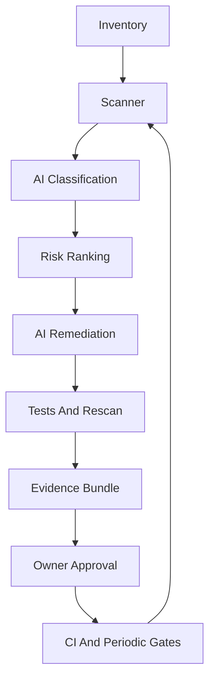

# AI-First Sensitive Data Masking Compliance Program

This document is the executable guide for applying the toolkit across department-owned systems. It complements the machine-readable taxonomy, policy catalog, inventory schema, scanner, remediation playbooks, and evidence generator.

## Objective

Create a repeatable AI-SDLC workflow that discovers sensitive user information, classifies risk, proposes and applies masking remediation, verifies outcomes, and produces audit evidence with minimal human involvement.

## System Loop

## Required Artifacts Per Service

- Inventory record in the format defined by `tools/privacy-inventory/inventory.schema.json`.
- Scanner findings from `tools/privacy-scanner/privacy_scanner.py`.
- AI classification decisions mapped to `sensitive-data-taxonomy.yaml`.
- Remediation tasks mapped to `masking-policy-catalog.yaml` and `tools/privacy-remediation/playbooks.md`.
- Evidence bundle generated by `tools/privacy-evidence/generate_evidence.py`.
- Exception records for any accepted raw-data exposure.

## AI Agent Workflow

1. Read the service inventory and repository context.
2. Run the deterministic scanner and preserve the raw finding output.
3. Enrich findings with AI classification, using source references rather than guesses.
4. Rank findings by severity, confidence, exposure, and blast radius.
5. Select the matching remediation playbook.
6. Make scoped code or configuration changes.
7. Add or update tests that prove raw values are absent.
8. Regenerate the evidence bundle and mark findings only when proof exists.
9. Ask humans only for policy approval, high-risk behavior changes, or expiring exceptions.

## Human Approval Gates

Humans should not manually inspect every code path. They should approve:

- taxonomy and masking policy changes;
- service inventory ownership;
- access-controlled reveal workflows;
- exceptions and accepted risks;
- production rollout after pilot evidence passes.

## Continuous Controls

- Run the privacy scanner on every pull request in advisory mode first.
- Enforce `critical` findings after false positives are tuned.
- Schedule recurring full scans for all department-owned systems.
- Track exception expiry and require reapproval before expiry.
- Feed recurring false positives and remediation patterns back into the rule catalog and playbooks.
